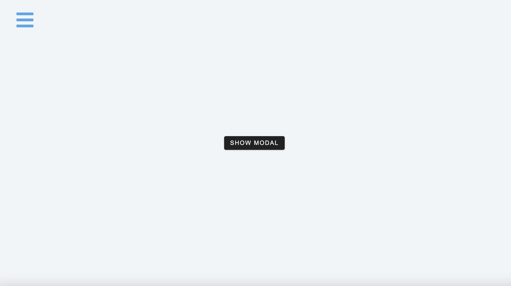
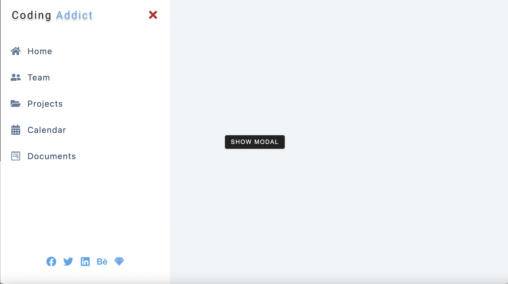
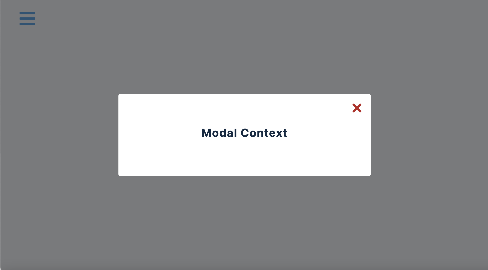

## Navigation Bar Web

### Description

- A web of sidebar and modal
- The sidebar can be opened by clicking the bar button on the top left
- The sidebar can be closed by clicking the cross buttons on the top right of the sidebar
- The topics and social links are displayed in the sidebar
- The modal window can be opened by clicking the "show modal" button
- The modal window can be opened by clicking the cross buttons on the top right of the modal window
- The content of modal is displayed in the modal window

### The captures of the web

#### Default layout

#### Sidebar display

#### Modal window display

